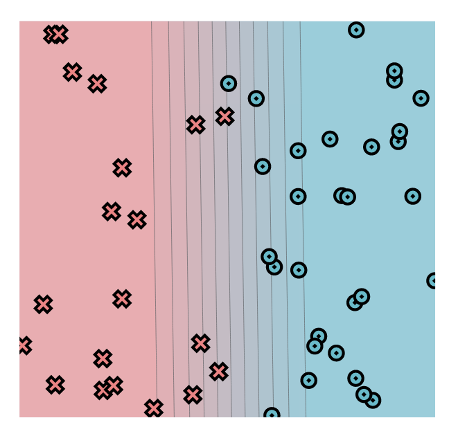
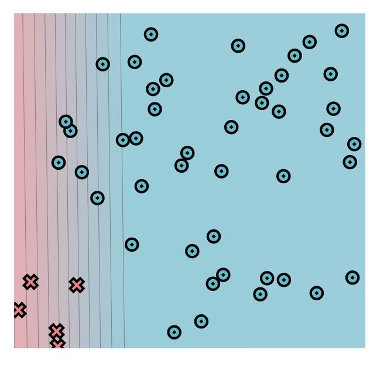
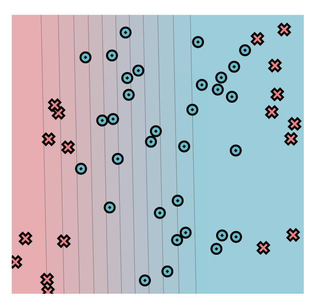
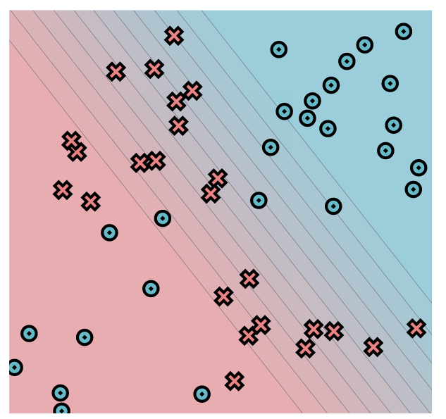

# MiniTorch Module 0

* Docs: https://minitorch.github.io/

* Overview: https://minitorch.github.io/module0.html

Result of task0.5:
 
	Dataset -> Simple ;
	Parameter: linear.weight_0_0 -> -6.4 ;
	Parameter: linear.weight_1_0 -> -0.09 ;
	Parameter: linear.bias_0 -> 3.14
	 

 
	Dataset -> Diag ;
	Parameter: linear.weight_0_0 -> -7.32 ;
	Parameter: linear.weight_1_0 -> -0.09 ;
	Parameter: linear.bias_0 -> 1.11
	 

 
	Dataset -> Diag ;
	Parameter: linear.weight_0_0 -> -4.48 ;
	Parameter: linear.weight_1_0 -> -0.09 ;
	Parameter: linear.bias_0 -> 1.62
	 

 
	Dataset -> Diag ;
	Parameter: linear.weight_0_0 -> -4.48 ;
	Parameter: linear.weight_1_0 -> -3.36 ;
	Parameter: linear.bias_0 -> 4.09
	 

"# Minitorch_module0" 
